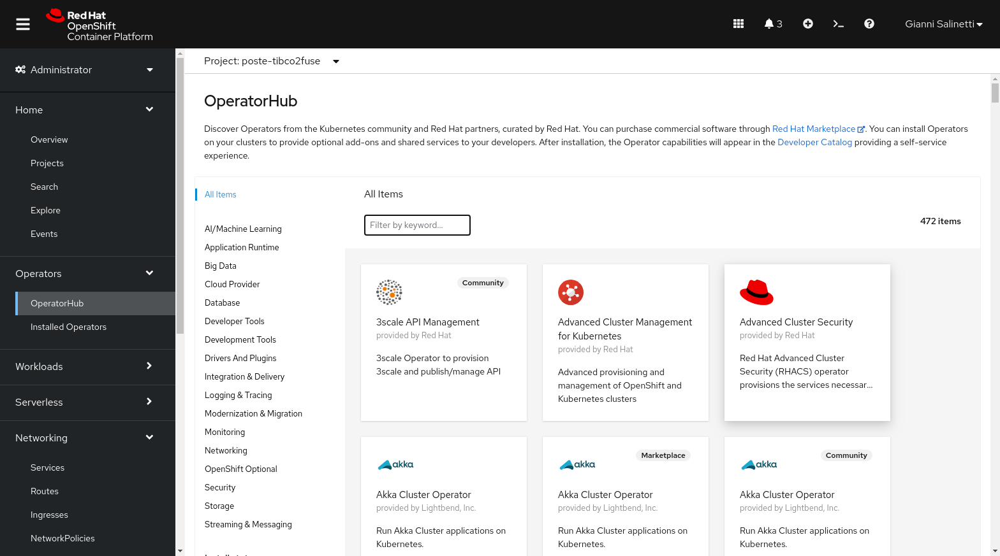
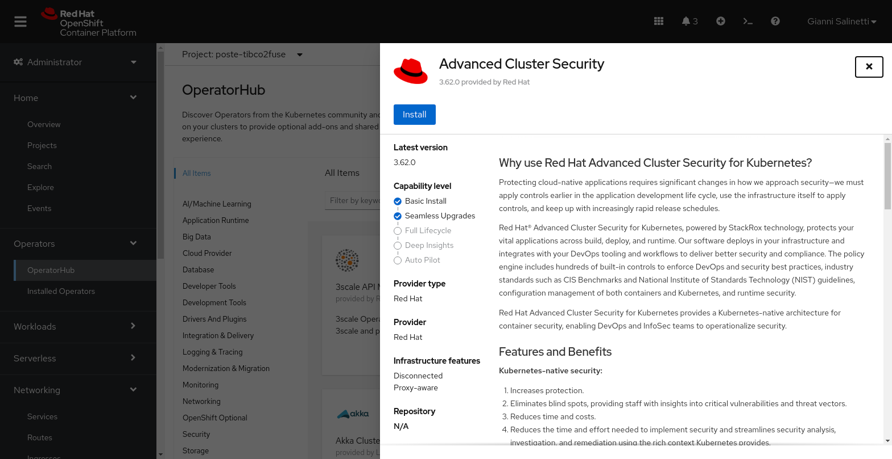
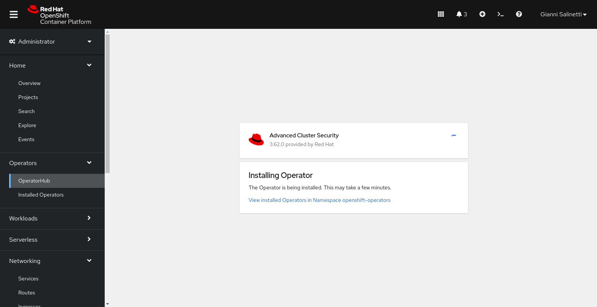
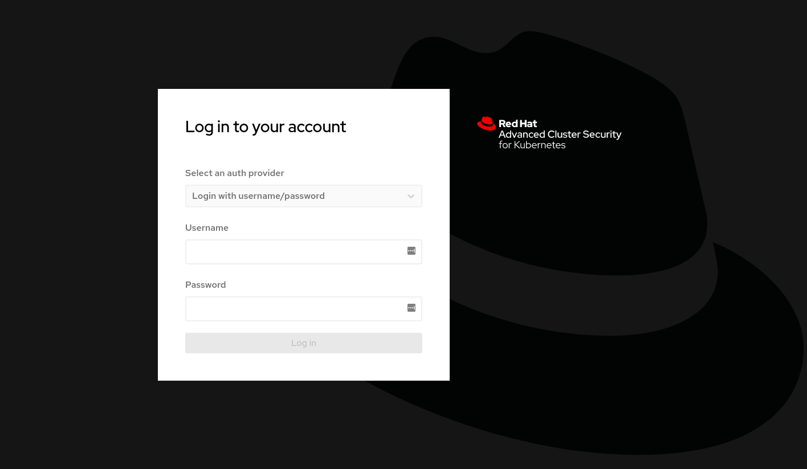
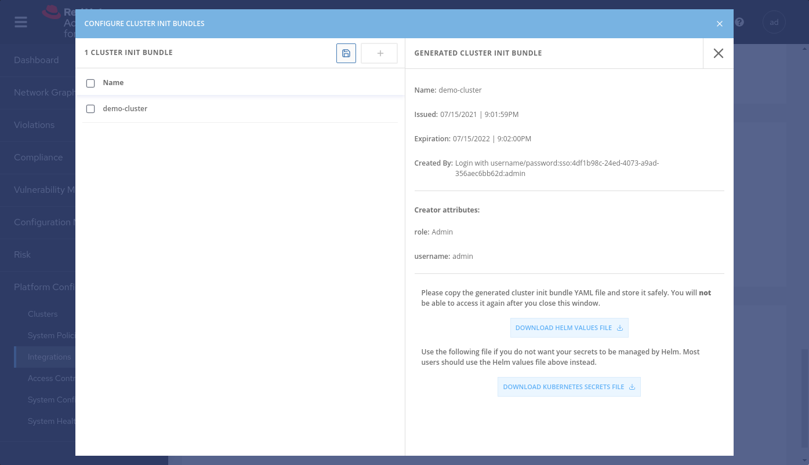

# Red Hat Advanced Cluster Security Operator Demo

## Operator Setup
Find and the Advanced Cluster Security Operator from the Operator Hub.



Install the selected operator by clicking on the `Install` button.



Confirm default installation parameters (auto update, latest channel, `openshift-operators` namespace).


Wait for completion, the installation will take a few seconds.



Access the now ready operator by clicking on the `View Operator` button.


## Central installation
In this section we will deploy the **Central** component in the lab cluster.
The **Central** is made up two main deployments:
- The `central` service, which exposes api and console and communicates with Sensors on secured clusters.
- The `scanner` service, which has the role of scanning the deployed pods images.

Create a new `stackrox` namespace. We will install our components here.
```
oc new-project stackrox
```

The following is an example of the `central` custom resource:
```
apiVersion: platform.stackrox.io/v1alpha1
kind: Central
metadata:
  name: stackrox-central-services
  namespace: stackrox
spec:
  central:
    exposure:
      loadBalancer:
        enabled: false
        port: 443
      nodePort:
        enabled: false
      route:
        enabled: true
    persistence:
      persistentVolumeClaim:
        claimName: stackrox-db
  egress:
    connectivityPolicy: Online
  scanner:
    analyzer:
      scaling:
        autoScaling: Enabled
        maxReplicas: 5
        minReplicas: 2
        replicas: 3
    scannerComponent: Enabled
```


Create the `central` custom resource using the template file provided in this repository.
```
oc apply -f stackrox-central-services.yaml -n stackrox
```

Monitor the installation using the *watch* option:
```
oc get pods -n stackrox -w
```

Once the installation is complete obtain the generated admin password from the `central-htpasswd` secret.
```
oc -n stackrox get secret central-htpasswd -o go-template='{{index .data "password" | base64decode}}'
```

Extract the hostname of the generated route.
```
oc get routes/central -n stackrox -o jsonpath='{.spec.host}'
```

Login to `https://<route_hostname>` using the `admin` username and the password extracted before.


## Securing a cluster

To join a cluster to ACS it is necessary to generate a cluster init bundle containing TLS secrets for Sensor, Collectors and Admission Controllers.

Generate the cluster init bundle by accessing the `Integration` subsection in the `Platform Configuration` section


Generate the bundle with a unique cluster name.  


Download the cluster init bundle secret.   



Apply the cluster init bundle secret on the target secured cluster
```
oc apply -f ~/Downloads/demo-cluster-cluster-init-secrets.yaml -n stackrox
```

**NOTE**: This demo uses the same cluster as central and secured cluster. In a real time scenario there will be many different secured clusters.
Please ensure to install the ACS Operator in all the secured cluster in order to manage the SecuredCluster CR.

Create the Secured Cluster custom Resource.
```
oc apply -f stackrox-secured-cluster-services.yaml -n stackrox
```

Monitor the installation using the *watch* option:
```
oc get pods -n stackrox -w
```

At the end of the installation, go to the central console and check the correct attachment of the secured cluster.


## Maintainers
Gianni Salinetti <gsalinet@redhat.com>
